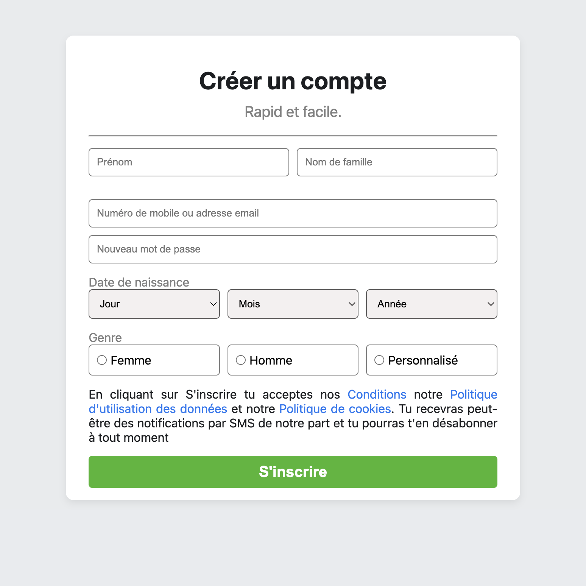
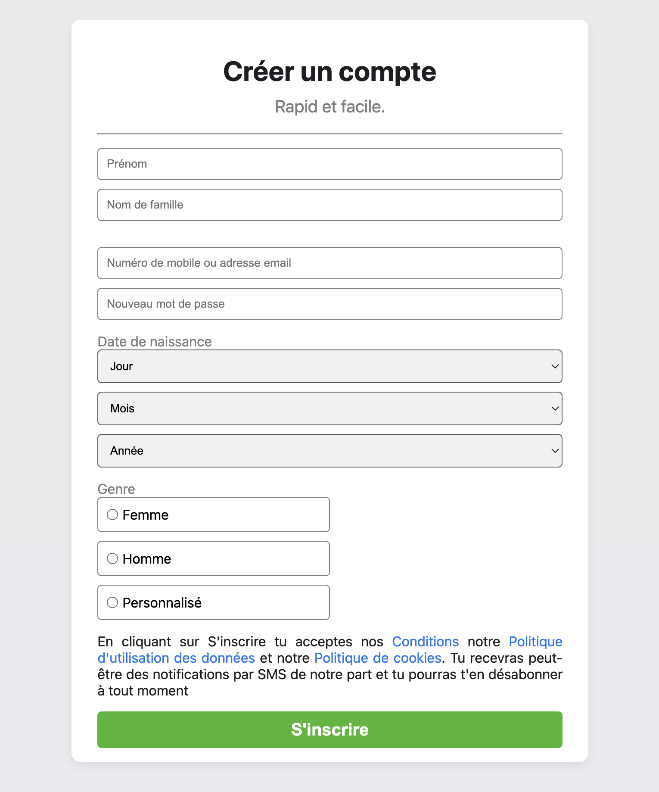

# Reproduction de la page d'inscription Facebook

## Description du projet

Ce projet a pour objectif de reproduire l'interface du formulaire d'inscription de Facebook à des fins d'apprentissage.
Il s'agit d'un exercice pratique en HTML et CSS (et éventuellement JavaScript) pour améliorer la compréhension des concepts de mise en page, formulaires et design responsive.

Le but n’est pas de copier le fonctionnement réel de Facebook, mais simplement d’en imiter l’apparence visuelle.

## Fonctionnalités

- Reproduction fidèle de la mise en page du formulaire d’inscription de Facebook.

- Champs de saisie : prénom, nom, email/téléphone, mot de passe, date de naissance, genre, etc.

- Bouton d’inscription stylisé.

- Design responsive (adapté aux écrans mobiles et ordinateurs).

## Technologies utilisées

HTML5
CSS3

## Aperçu

## Lien Demo
